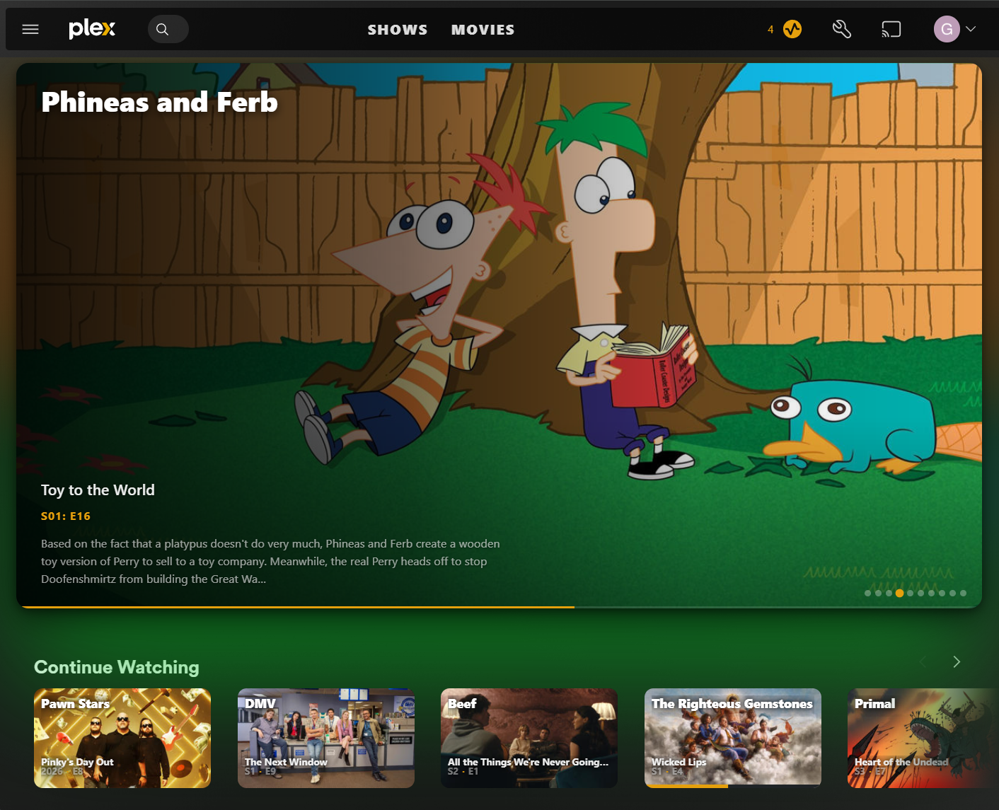
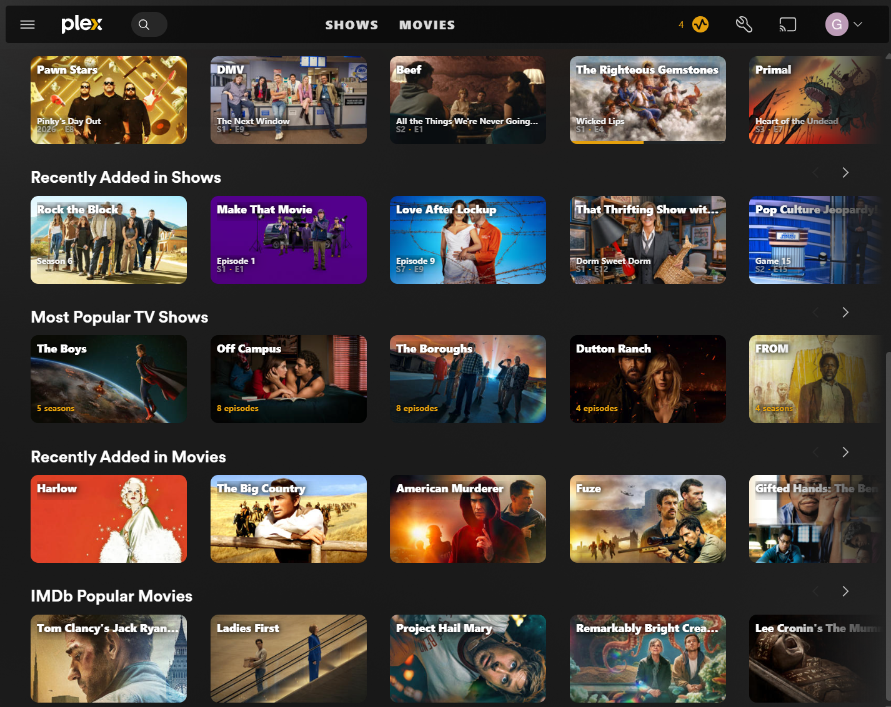
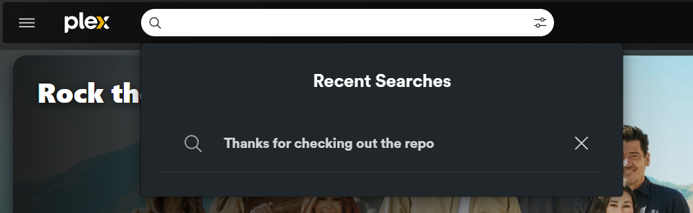

# Plex 16:9 Cards

A [Tampermonkey](https://www.tampermonkey.net/) userscript that restyles **Plex Web** (`app.plex.tv`) with cinematic 16:9 artwork, a Recently Added hero carousel, and a cleaner top navigation bar.

## Features

- **16:9 backdrop cards** — swaps Plex's portrait posters for wide landscape artwork, with the title / subtitle / episode overlaid and a soft shadow for legibility. Falls back to the original poster if no backdrop art exists.
- **Recently Added hero carousel** — a full-width, auto-advancing hero at the top of the home screen, built from your most recently added shows and/or movies. Includes prev/next arrows, dot navigation, a progress bar, and an ambient blurred backdrop. Click a slide to open the item.
- **Streamlined top bar** — moves your pinned libraries into the header as bold, all-caps links (the Plex logo still goes home), collapses the search box to an icon that expands on click, and reclaims the old sidebar space for content. The ☰ menu still opens the full library list.
- **Loading skeleton** — a subtle shimmer covers the initial paint so you don't watch Plex's layout reflow into place.

## Installation

1. Install the [Tampermonkey](https://www.tampermonkey.net/) browser extension (Chrome, Edge, Firefox, Safari).
2. **[Click here to install »](https://raw.githubusercontent.com/gl0ryus/Plex-Carousel/main/plexCardsUI.user.js)** — Tampermonkey opens an install tab; click **Install**.
3. Open [app.plex.tv](https://app.plex.tv) and head to your home screen.

New versions are delivered automatically by Tampermonkey whenever an update is pushed.

## Configuration

Open the script in the Tampermonkey dashboard and edit the `CONFIG` block at the top:

| Option | Default | What it does |
|---|---|---|
| `CAROUSEL_CONTENT` | `'shows'` | What the hero pulls from: `'shows'`, `'movies'`, or `'both'`. |
| `HERO_SLIDE_LIMIT` | `10` | Maximum number of slides in the carousel. |
| `HERO_INTERVAL_MS` | `6000` | Time, in ms, between auto-advances. |
| `HERO_VIEWPORT_RESERVE` | `300` | Px reserved at the bottom so the first row peeks below the hero. Lower = taller hero. |
| `RECENT_ITEMS_LIMIT` | `50` | Items fetched per library when building the carousel. |
| `ENABLE_TOP_NAV` | `true` | Set to `false` to keep Plex's stock top bar and sidebar. |
| `NAV_SEARCH_WIDTH` | `480` | Px width of the search box when expanded. |

A few more fine-tuning constants (aspect ratios, opacities, debounce timing) are documented inline.

## Compatibility & caveats

- Works on **`app.plex.tv`** only. If you reach Plex through a custom domain or a local address (e.g. `http://192.168.x.x:32400/web`), add a matching `@match` line to the header.
- The carousel reads "Recently Added" directly from **your own Plex server**, using the token already present in the page — nothing is sent anywhere else.
- This script hooks into Plex Web's internal markup, so a major Plex update can change those class names and temporarily break parts of the styling. Please [open an issue](https://github.com/gl0ryus/Plex-Carousel/issues) if something looks off and the selectors will be patched.

## License

[MIT](LICENSE) © gl0ryus
